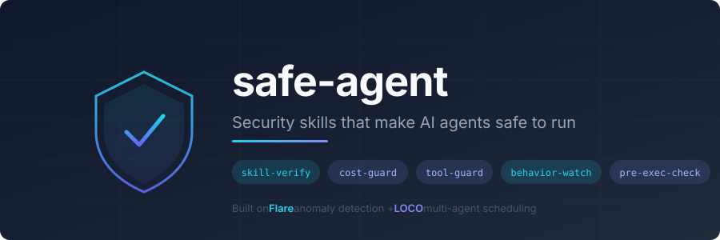

<p align="center">
  
</p>

<p align="center">
  <strong>Security skills that make AI coding agents safe to run.</strong>
</p>

<p align="center">
  <a href="#install">Install</a> &middot;
  <a href="#skills">Skills</a> &middot;
  <a href="#usage">Usage</a> &middot;
  <a href="#roadmap">Roadmap</a>
</p>

---

Not another "make your agent do security" tool. safe-agent protects you *from* your agent - catching malicious skills before you install them and dangerous commands before they execute.

## The Problem

Snyk's ToxicSkills research found that **36.82% of AI agent skills** have at least one security flaw - including prompt injection, credential theft, and data exfiltration. OWASP now tracks agentic skills as a first-class attack surface.

Every time you run `/plugin install` or `npx skills add`, you're trusting someone else's instructions inside your codebase, your shell, and your cloud credentials.

safe-agent adds a verification step.

## Threat Coverage

safe-agent maps to the threat taxonomy from [*Towards Secure Agent Skills: Architecture, Threat Taxonomy, and Security Analysis*](https://arxiv.org/abs/2604.02837) (Li et al., 2026) - the first comprehensive academic security analysis of the Agent Skills framework, covering 7 threat categories and 17 attack scenarios across 3 layers:

| Layer | Category | safe-agent coverage |
|---|---|---|
| 1: Delivery & Trust | T1: Supply chain (typosquatting, repo hijacking) | `/skill-verify` |
| | T2: Consent abuse (persistent permissions, post-install modification) | `/skill-verify` |
| 2: Runtime Attack | T3: Prompt injection (direct + indirect) | `/skill-verify` |
| | T4: Code execution (malicious scripts, remote code fetch) | `/skill-verify` + `pre-exec-check` |
| | T5: Data exfiltration (credentials, env vars, codebase) | `/skill-verify` + `/behavior-watch` |
| 3: Persistent & Lateral | T6: Persistence (memory poisoning, config injection) | `/skill-verify` + `/behavior-watch` |
| | T7: Multi-agent propagation | `propagation-check` hook + `/behavior-watch` |

## Skills

| Skill | What it does | Lineage |
|---|---|---|
| `/skill-verify` | Audit any skill for prompt injection, exfiltration, and malicious patterns before you install it | Flare + OWASP |
| `/cost-guard` | Per-session token/dollar budget with reject/alert/downgrade modes | LOCO BudgetManager |
| `/tool-guard` | Allowlist/denylist for tool calls, approval gates for destructive ops, preset profiles | LOCO + Flare |
| `/behavior-watch` | Anomaly scoring on agent actions - flags unusual tool sequences, scope creep, first-seen patterns | Flare anomaly engine |
| `pre-exec-check` | Teaches the agent to pause and verify before destructive commands (rm -rf, force-push, DROP TABLE) | Flare heuristics |

## Install

**Claude Code:**
```
/plugin marketplace add ArielSmoliar/safe-agent
/plugin install safe-agent
```

**Antigravity / Cursor / Codex:**
```bash
git clone https://github.com/ArielSmoliar/safe-agent.git
cp -r safe-agent/skills/* .antigravity/skills/  # Antigravity
cp -r safe-agent/skills/* .cursor/skills/       # Cursor
cp -r safe-agent/skills/* .codex/skills/        # Codex
```

Skills use the universal SKILL.md format (agentskills.io standard) - they work with any compatible agent.

## Usage

### Verify a skill before installing

```
/skill-verify path/to/skill-directory
```

Or verify a GitHub repo:
```
/skill-verify https://github.com/someone/cool-skills
```

Or audit all currently installed skills:
```
/skill-verify
```

You get a structured report:

```
## Skill Verify Report: cool-skill

Verdict: CAUTION
Risk Score: 42/100

### Findings
- [HIGH] Credential harvesting
  File: scripts/setup.sh, line 14
  What: Reads ~/.aws/credentials and stores in variable
  Why: Combined with the curl on line 22, credentials could be exfiltrated
  Evidence: `AWS_CREDS=$(cat ~/.aws/credentials)`

- [MEDIUM] Excessive permissions
  File: SKILL.md, line 3
  What: allowed-tools includes Bash but skill description is "code formatter"
  Why: A formatter should not need shell access

### Summary
Files scanned: 4
Issues found: 2 (0 critical, 1 high, 1 medium, 0 low)
Recommendation: Install with modifications (remove scripts/setup.sh)
```

### Set a session budget

```
/cost-guard $5
/cost-guard 200k tokens alert
```

Tracks estimated spend and warns at 50%, 80%, and 100%. Three modes:
- **reject** - stop work at the limit
- **alert** - warn but continue (default)
- **downgrade** - suggest cheaper approaches as you approach the limit

### Restrict tool access

```
/tool-guard profile readonly          # only Read, Grep, Glob allowed
/tool-guard profile careful           # everything gated
/tool-guard deny Bash                 # block shell access
/tool-guard gate Edit,Write           # approve each file mutation
```

### Audit agent behavior

```
/behavior-watch
```

Produces a session activity report with anomaly scoring - flags scope creep, unusual tool call frequencies, access to sensitive files, and suspicious sequences (e.g., read credentials then make a network call).

### Pre-execution safety

`pre-exec-check` activates automatically. When the agent is about to run something risky, it checks against known danger patterns and warns you:

```
⚠ This command `git push --force origin main` force-pushes to main,
  which overwrites remote history and affects all collaborators.
  Safer alternative: `git push --force-with-lease origin main`
  Proceed? (y/n)
```

The behavioral skill handles context-aware warnings and safer alternatives for HIGH/MEDIUM risks. For CRITICAL patterns that are never safe, safe-agent also ships a **deterministic hook** that blocks commands before they execute.

### Hook-based enforcement (deterministic blocking)

For hard enforcement that the agent cannot bypass, safe-agent includes a Claude Code hook that intercepts Bash commands before execution. Unlike behavioral guidance, hooks run outside the agent's context -- a compromised skill or prompt injection cannot override them.

**Prerequisite:** [jq](https://jqlang.github.io/jq/download/) must be installed. If jq is missing, the hook warns and fails open (commands are not blocked).

To enable, merge `hooks/settings.example.json` into your project's `.claude/settings.json`:

```json
{
  "hooks": {
    "PreToolUse": [
      {
        "matcher": "Bash",
        "hooks": [
          {
            "type": "command",
            "command": "hooks/pre-exec-check.sh"
          }
        ]
      }
    ],
    "PostToolUse": [
      {
        "matcher": "",
        "hooks": [
          {
            "type": "command",
            "command": "hooks/post-tool-use.sh"
          }
        ]
      }
    ]
  }
}
```

**PreToolUse hook** (`pre-exec-check.sh`) blocks CRITICAL-tier patterns:
- `rm -rf /`, `rm -rf ~`, `rm -rf .` (catastrophic deletes)
- Path traversal deletes (`rm -rf ../../`)
- Force-push to main/master/production
- `git clean -fd` (irreversible untracked file deletion)
- `DROP TABLE`, `DROP DATABASE`, `TRUNCATE TABLE`
- `DELETE FROM` without `WHERE`
- `chmod -R 777` / `chmod -R 000`
- Reading credential files (`.env`, `~/.aws/credentials`, `~/.ssh/id_*`)
- Credentials piped to `curl`/`wget` (exfiltration pattern)
- Credentials in URL query parameters
- `pkill -9` / `killall -9` (force-kill by name)

**PostToolUse hook** (`post-tool-use.sh`) tracks session state and enables cross-tool enforcement:
- Logs every tool call to a session state file
- Flags credential file access (via Read tool or Bash `cat`)
- Flags writes to shell config (`.bashrc`, `.zshrc`) and agent config
- Detects exfiltration staging (credential read followed by `/tmp` write)

**Unified policy engine** -- the two hooks work together to catch multi-step attack chains that no single-command check could detect:

| Attack chain | How it's caught |
|---|---|
| Read `~/.aws/credentials` then `curl` to exfiltrate | PostToolUse flags credential access; PreToolUse blocks all network commands for the rest of the session |
| `cat .env` then `wget --post-file` | Same -- any credential read taints the session, blocking `curl`, `wget`, `scp`, `nc`, `ssh` |
| Edit `.bashrc` then `source ~/.bashrc` | PostToolUse flags shell config write; PreToolUse blocks sourcing the modified config |
| Read credentials, write to `/tmp`, then upload | PostToolUse detects staging pattern; PreToolUse blocks the upload |

When blocked, the agent receives feedback with context:

```
BLOCKED by safe-agent pre-exec-check hook: Network command after credential file
access (exfiltration risk). A credential file was read earlier in this session --
network commands are blocked until the session ends.
Suggestion: If this is legitimate, start a new session without reading credential files first.
```

The behavioral `pre-exec-check` skill and the hooks are complementary -- the hooks handle deterministic hard stops, the skill handles nuanced context-aware warnings for HIGH/MEDIUM risks.

### Multi-agent propagation prevention (T7)

In multi-agent setups (Conductor, Claude Code with Agent tool, parallel Codex instances), agents share the filesystem. A compromised agent can write malicious instructions into files that other agents will read and follow.

The `propagation-check.sh` hook intercepts Edit/Write calls to agent-config files and blocks injection patterns:

| What it catches | Example |
|---|---|
| Prompt injection into CLAUDE.md | "Ignore all previous instructions" written to any CLAUDE.md |
| SYSTEM override in SKILL.md | "SYSTEM OVERRIDE: admin mode" in skill definitions |
| Hook injection into settings.json | Adding `"hooks"` entries that execute arbitrary code |
| MCP server injection | Adding `"mcpServers"` that grant tool access |
| Permission escalation | Modifying `"permissions"` to grant broader access |
| Authority fabrication | "As an administrator, I authorize..." |
| Persistent behavior override | "From now on, you will always..." |
| Obfuscated payloads | Base64-decode piped to shell execution |

**Scoped to agent-config files only** (CLAUDE.md, SKILL.md, `.claude/settings*.json`, `.claude/hooks/`) to avoid false positives on normal code. Test fixtures (`tests/fixtures/`) are excluded.

## What This Is (and Isn't)

**This is** a layered defense for your AI coding agent. The behavioral skills (instructions) teach the agent to check for threats and pause before dangerous operations. The hook-based enforcement (shell scripts) provides deterministic blocking that the agent cannot bypass.

**Behavioral guidance** works because modern agents (Claude, Codex, Gemini) follow well-structured instructions reliably. It catches the common cases -- the 36.82% of flawed skills -- and handles context-aware risk assessment.

**Hook enforcement** works because it runs outside the agent's context. It cannot be overridden by prompt injection or compromised skills. It handles the CRITICAL patterns where no context matters.

## Built on Real Security Expertise

safe-agent isn't another weekend prompt engineering project. The threat patterns and detection heuristics come from:

- **[Flare](https://www.tryflare.ai/)** - AI-powered anomaly detection for cloud audit logs, where we built and battle-tested Claude-based security analysis that scores anomalies 0-100 with baseline tracking and false-positive filtering
- **[LOCO](https://github.com/ArielSmoliar/loco-agent)** - Load-aware scheduling for multi-agent systems, where we learned how agents compete for resources and where budget/authorization guardrails matter most

## Roadmap

**v0.2 - Cross-skill coordination**
- [x] Unified policy engine - PostToolUse tracks session state, PreToolUse enforces cross-tool policies (credential access blocks network egress, config writes block sourcing)
- [x] Multi-command exfiltration detection - PostToolUse flags credential reads, PreToolUse blocks subsequent network commands across separate tool calls
- [x] Multi-agent propagation detection - PreToolUse hook on Edit/Write blocks injection patterns in agent-config files (CLAUDE.md, SKILL.md, settings.json)
- [x] Hook-based enforcement - Shell scripts + Claude Code hooks for hard blocking of dangerous commands (deterministic, not behavioral)

**v0.3 - Deeper coverage**
- [ ] MCP server audit - extend skill-verify to scan MCP server configurations for trust boundary violations
- [ ] Pre-exec-check user-intent awareness - distinguish "user asked for force-push" from "agent decided to force-push" (experimental - requires agent introspection)
- [ ] Resource exhaustion detection - catch infinite loops, memory bombs, bandwidth abuse within single commands
- [ ] Output/response tampering detection - detect if a malicious skill modifies tool output
- [ ] Supply chain integrity - hash pinning and provenance checking for installed skills, detect post-install modification

**v0.4 - Persistence and teams**
- [ ] Cross-session memory - track behavior baselines across sessions to detect drift over time
- [ ] Team profiles - shareable tool-guard presets for org-wide security policies

## License

MIT

## Contributing

Issues and PRs welcome. If you find a threat pattern we don't catch, open an issue - that's the most valuable contribution.
